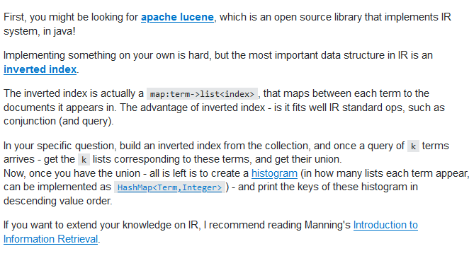
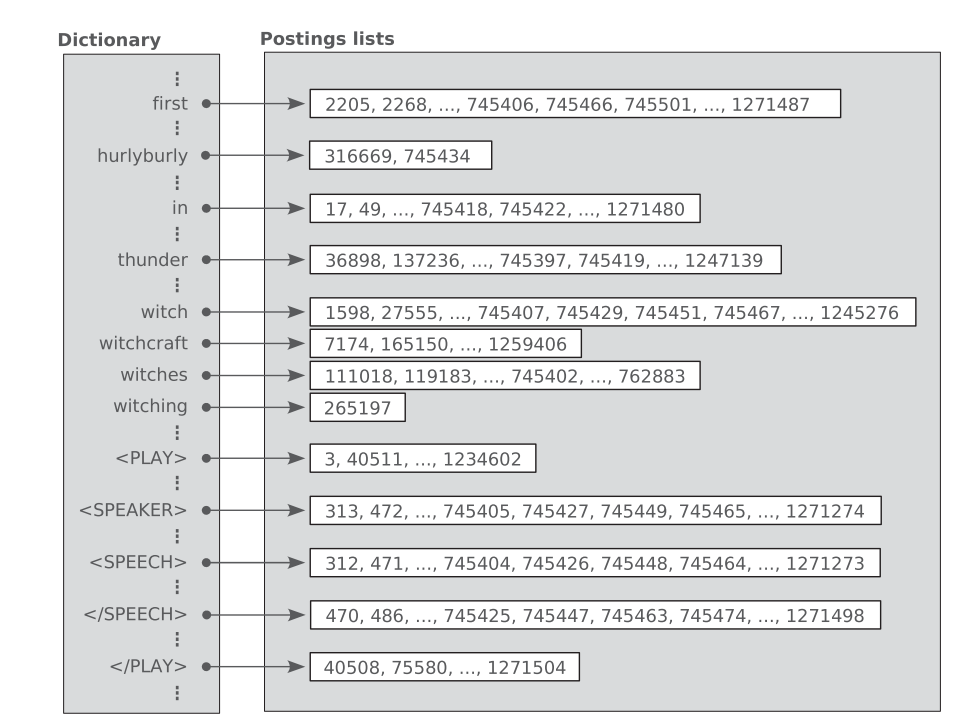
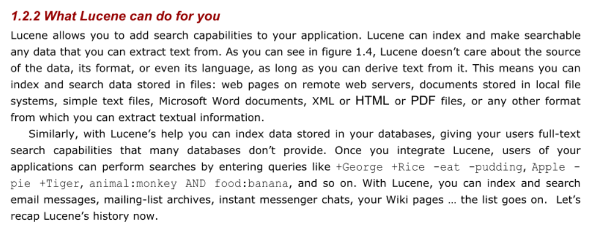
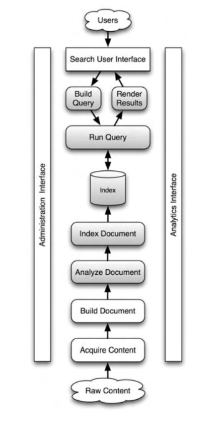

# IR: Lab Class

## TODOs

#### 1. Aquire Content

Nothing to do here. The content is already provided with the repo `information-retrieval-ss20-leipzig`. The following databases are given:

- Dataset ACL20
- Dataset SIGIR19
- Dataset Touche

#### 2. Build Document

This step is also done already. We need to figure out ...

- How to extract the data from the `CSV` files.
- Analyse the given fields and construct data structures to support them, namely `Fields` and `Documents`

#### 4. Analyze Document

We can use Lucene to 

1. Tokenize the data
2. Do the linguistic pre-processing of tokens.

#### 5. Index Document

Lucene can handle all the work for creating the index. Specifically, we need to...

- Build the **inverse index** 
- We probably need to construct a **stop list**
- Perform **token normalization** to optimize the index size

### 6. Construct a user interface

Not sure if we need to implement this or whether we use **Tira** at this point

### 7. Build Query

Build a server model and a **Query Parser**

## Questions

- [ ] What is a retrieval status value?
- [ ] Do we need to create a **user interface**?
- [ ] What is Tira?
- [ ] What is a baseline retrieval
- [ ] What is a standard TREC format?
- [ ] What goes into the lab report?
- [ ] Do we need to create a server for the search engine?

## Create an Inverted Index

The major steps in inverted index construction are ...

1. Collect the documents to be indexed.
2. Tokenize the text.
3. Do linguistic pre-processing of tokens.
4. Index the documents that each term occurs in.

## Terminology

### Inverted Index

- The central data structure for information retrieval.
- We need this data structure for our search queries
- provides a mapping between terms and their locations of occurrence in a text collection
- Is schema independent. In other words, it makes no assumptions about the structure of the document
- Because the size of an inverted list is on the same order of magnitude as the document collection itself, care must be taken that index access and update operations are performed efficiently.

A schema-independent inverted index for Shakespeare’s plays. The dictionary provides a mapping from terms to their positions of occurrence.

### Lucene

[Lucene Core](https://lucene.apache.org/core/) is a Java library providing 

- powerful indexing and search features, 
- spellchecking, 
- hit highlighting, and
- advanced analysis/tokenization capabilities.

McCandless 1.2.2: Lucene Summary

### Typical Components of Search Engines

McCandless 12.5: Typical components of search application

