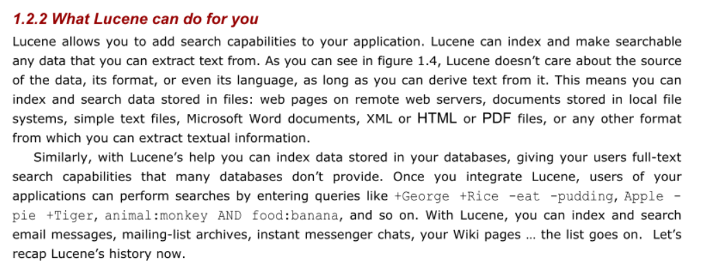

# Terminology & Concepts

This is a list of terms and concepts relating to information retrieval.

When editing, please keep this list in **alphabetical order**.

## Create an Inverted Index

The major steps in inverted index construction are ...

1. Collect the documents to be indexed.
2. Tokenize the text.
3. Do linguistic pre-processing of tokens.
4. Index the documents that each term occurs in.

## Inverted Index

- The central data structure for information retrieval.
- We need this data structure for our search queries
- provides a mapping between terms and their locations of occurrence in a text collection
- Is schema independent. In other words, it makes no assumptions about the structure of the document
- Because the size of an inverted list is on the same order of magnitude as the document collection itself, care must be taken that index access and update operations are performed efficiently.

A schema-independent inverted index for Shakespeare’s plays. The dictionary provides a mapping from terms to their positions of occurrence.

## Lucene

[Lucene Core](https://lucene.apache.org/core/) is a Java library providing 

- powerful indexing and search features, 
- spellchecking, 
- hit highlighting, and
- advanced analysis/tokenization capabilities.

McCandless 1.2.2: Lucene Summary

## Typical Components of Search Engines

McCandless 12.5: Typical components of search application

