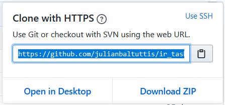

# Using Tortoise Git

The most important thing about using the turtle and Git in general is to always stick to the same procedure while working:

1. Pull the data.
2. Choose the right branch to work on.
3. Do your work.
4. Commit your work.
5. Push your commits.

If you stick to this order, you will minimize error messages and headaches down the road.

## Cloning a repository

1. You need a https link in order to clone a repository from the internet

   ```
   https://github.com/julianbaltuttis/ir_task_01
   ```

<div style="text-align:center">Github repository for info retrieval</div>

2. In Github that link is a green button on the right called `Clone or download`

   

3. Copy the link to the pasteboard

   

4. Switch to the file browser and in the folder where you want to clone your repository right mouse click and pick `Git Clone`

   

5. Paste the URL, leave everything else as default and hit `ok`.

   

<div style="page-break-after: always; break-after: page;"></div>

## Using the Tortoise log 

The turtle log can be used to display the current working repository as a graph with all current branches and commits. 


<div style="page-break-after: always; break-after: page;"></div>

### Open the turle log

To display it, simply right click on your git folder and choose `TortoiseGit`-> `Show log`


### Log Dialog Explanations


#### 1. Graph

The Graph column with a line shows the commits, merges and branches. There are two types of shapes.

1. The circles indicate normal commits w/o any branching. 
2. The squares indicate merges and branchings. 

The colors of the lines (and of the shapes) are there to make the graph better readable 

#### 2. Actions

The top pane has an Actions column containing icons that summarize what has been done in that  revision. There are four different icons, each shown in its own column.

If a revision modified a file or directory, the *modified* icon is shown in the first column.

If a revision added a file or directory, the *added* icon is shown in the second column.

If a revision deleted a file or directory, the *deleted* icon is shown in the third column.

If a revision replaced(rename) a file, the *replaced* icon is shown in the fourth column.

#### 3. Message

The top pane also has a message column. In this column the subjects of the commits are shown. Commits which  have an associated reference are decorated with a label.

Tags are  by default displayed as yellow rectangles. In Git there are two tag  types: normal tags and annotated tags. The annotated ones have an apex  at the right side.

Normally branches are displayed as normal  rectangles. The active branch is displayed as a dark red rectangle (by  default), the green ones are local branches and the peach ones are  remote branches.

The boxes with rounded corners for local branches indicate that it has an associated remote tracking. The boxes with  rounded corners for remote tracking branches are used to indicate which  of (possible several remote branches) is the corresponding remote  tracking branch (e.g., master and origin/master).

The stash has a dark grey rectangle.

There are also reactangles to indicate the bad versions (light red) on bisecting, blue for known good and grey for skip.

<div style="page-break-after: always; break-after: page;"></div>

## Fetch or Pull before you work

Whenever you plan to code or make any new commits, you should always first update your repository. You do this by using Fetch or Pull. Both are used to download new data from a remote repository.

Downloading data is an essential step in your daily work - because  the remote data you are looking at in your local repository is just a  "snapshot". It's only as up-to-date as the last time you **explicitly** downloaded fresh data from the remote with "fetch" or "pull". It's  vital to keep this fact in mind when inspecting remote branches and commits!

#### Fetch

- **git fetch** really only downloads new data from a remote repository - but it doesn't integrate any of this new data into your  working files. 
- Fetch is great for getting a fresh view on all the things that happened in a remote repository.
- Due to it's "harmless" nature, you can rest assured: fetch will never manipulate, destroy, or screw up anything. 
- This means you can never fetch often enough.

To Fetch, right click on your repository folder and choose `TortoiseGit` → `Fetch`

#### Pull

- **git pull**, in contrast, is used with a different goal in mind: to update your current HEAD branch with the latest changes from  the remote server. 
- This means that pull not only downloads new data; it  also directly **integrates** it into your current working copy files. 
- This has a couple of consequences:
  1. Since "git pull" tries to merge remote changes with your local ones, a so-called "merge conflict" can occur.
  2. Since "git pull" tries to merge remote changes with your local ones, a so-called "merge conflict" can occur.

To Pull right click on your repository folder and choose `TortoiseGit` → `Pull`

<div style="page-break-after: always; break-after: page;"></div>

#### Cleaning up if Pull is fucked


<div style="text-align:center">The most fun error message. The turtle clearly hates me</div>

This usually happens because you forgot to pull before you made new changes. Turtle is trying to get all the new data from the online repository, but has found duplicate entries.

You have 2 options here:

1. Simply revert or delete your changes. You can do this in the log menu.
2. Commit your changes, then pull and fix all possible duplicate entries.

#### Reverting Changes

Here is how to quickly revert changes (This is often the best solution, especially if your IDE just made code changes without asking you):

1. Open the turtle log dialog

2. Right click on the `master`button and switch to `All`

   

3. On the bottom of the log, you can see a list of all files that have not been commited.

   

4. You can either right click and choose `Revert` or select and delete them. Use `Revert` when you made changes to existing files, use deletion when you made new files that cause problems.

<div style="page-break-after: always; break-after: page;"></div>

## Creating a new branch

Before you start coding and making commits, you should always, always create a new branch. Never ever blindly commit to the `Master` branch.

To create a new branch ...

1. Open the turtle log

2. Select the branch from which you want to branch off from (eg. `Master`)

3. Right click and choose `Create Branch at this version`

   

4. Choose a new name and check `Switch to new branch`

   

#### Naming convention

- Use a leading branch name followed by a slash `/`. Possible leads are
  - feature
  - hotfix
  - bug

- Add a short descriptor of the task. Do not use uppercase or camelcase. Use hyphens as separators
- End with a tracking id, ideally a global counting id.

<div style="page-break-after: always; break-after: page;"></div>

## Making commits

You can use tortoise git to commit and push changes. Note, that using the turtle to achieve this is optional. IDEs like IntelliJ provide easy ways to commit and push changes. Here is how to do it with the turtle:

1. Make some changes (said Capn't obvious) 

2. Before you commit, always make sure that you are in the **correct branch** to do so. Check the log or your IDE.

3. Right click on project and choose `Git Commit -> ...`

   

4. In the Git dialog you must

   1. Write a Git message
   2. Set author
   3. Pick the unversioned files that you want to commit
   4. Hit the commit button

   

### Git message syntax

- Start with `Refs #` + `Ticket number` + `:` . Eg: `Refs #0023:`
- Follow with a 3rd person conjugated verb + short description of your commit. Eg: `Fixes null point exception on function call`.
- Do not use more than 50 characters for your commit message. Be brief and to the point!

### Pushing commits

It is good practice to follow every commit with a push. Thus, the repository is updated more frequently.

To push, right click on your project folder and choose `TortoiseGit` → `Push`


In the Push dialog leave everything on default and hit `OK`.

